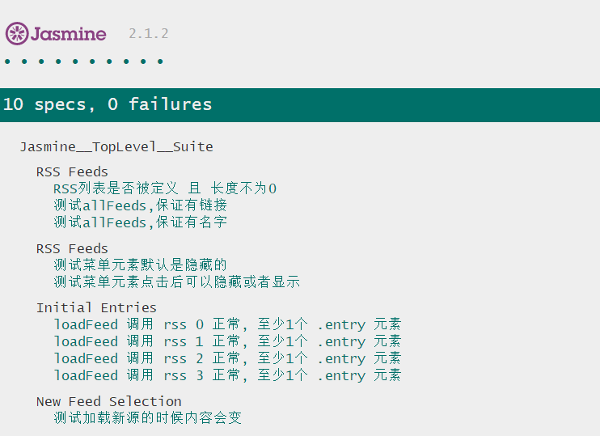

RSS阅读器测试项目呀

# 项目预览

在这个项目中，你会得到一个基于 web 的用来读取 rss 源的应用。最开始的这个项目的开发者意识到了测试的价值，他们也已经把 [Jasmine](http://jasmine.github.io) 包含在了项目之中，而且甚至已经开始写他们第一个测试用例。但是不幸的是，他们决定去创建一个他们自己的公司，所以我们现在拿到的是一个缺乏完整测试用例的应用，这样是你会参与到这个项目的原因。

## 项目目的

测试是开发过程中一个很重要的部分，很多组织把一个标准的开发过程称之为测试驱动开发。意思就是开发人员在他们开始着手编写应用代码之前先写好测试用例。当然这个时候所有的测试用例都是通不过的，然后他们就开始编写应用代码使测试全部通过。

# 项目做了的事情

1. 编写一个测试遍历 allFeeds 对象里面的所有的源来保证有链接字段而且链接不是空的。
2. 编写一个测试遍历 allFeeds 对象里面的所有的源来保证有名字字段而且不是空的。
3. 写一个叫做 `"The menu"` 的测试用例
4. 写一个测试用例保证菜单元素默认是隐藏的。你需要分析 html 和 css 来搞清楚我们是怎么实现隐藏/展示菜单元素的。
5. 写一个测试用例保证当菜单图标被点击的时候菜单会切换可见状态。这个测试应该包含两个 expectation ： 党点击图标的时候菜单是否显示，再次点击的时候是否隐藏。
6. 写一个叫做 `"Initial Entries"` 的测试用例
7. 写一个测试保证 `loadFeed` 函数被调用而且工作正常，即在 `.feed` 容器元素里面至少有一个 `.entry` 的元素。循环使用这个测试对所有的Rss源做一次遍历测试
8. 写一个叫做 `"New Feed Selection"` 的测试用例
9. 写一个测试保证当用 `loadFeed` 函数加载一个新源的时候内容会真的改变。

以上测试项做到

* 每个测试都不应该依赖别的测试的结果。
* 回调函数应该用来保证在测试运行之前源已经被加载。
* 实现未定义变量和数组越界的错误处理。
* 当完成所有任务的时候，所有的测试也应该通过。

## 最终运行实际运行结果如下

以上单元测试项全部通过